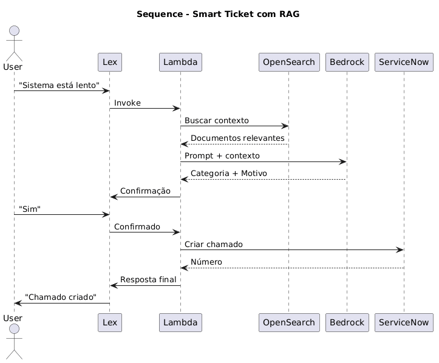
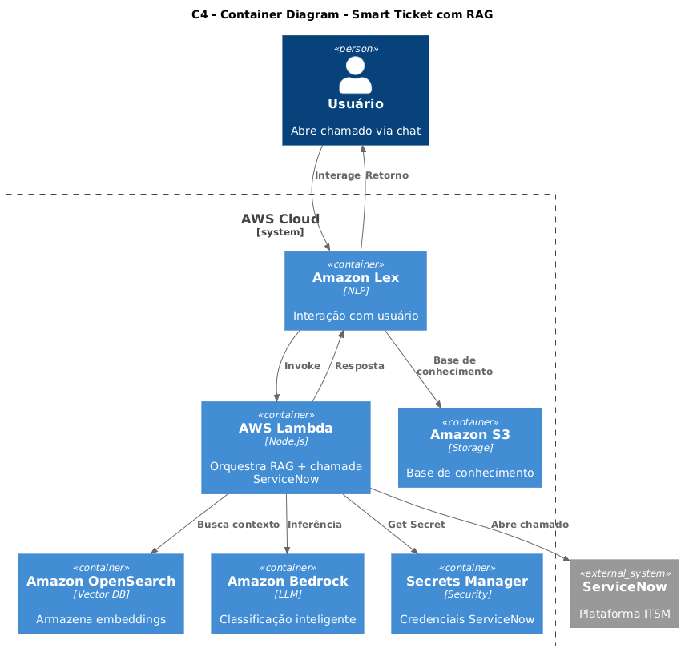
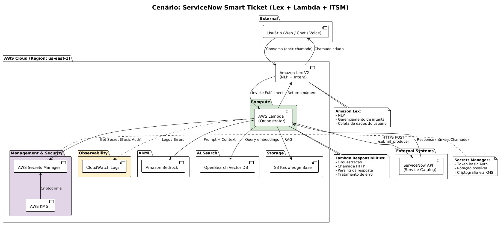

# Solution Architecture

**Integration with ServiceNow using Amazon Lex**

January 2026

Version: 0.2

Document History

Revisão do Documento

| **Review** | **Data**   | **Created**        | **Brief description of the changes** |
| ---------- | ---------- | ------------------ | ------------------------------------ |
| 0.1        | 20/01/2026 | Fabrizio Rodrigues | Initial Version                      |

Contents

1\. Description of Solution 4

1.1 Objectives and business rules 4

1.2 Overall project scope 4

2\. Business Scenario 5

2.1 Current State View 5

2.2 Opportunities and Solutions - TO-BE 8

2.2.1 Cenário 1: Recursos utilizados

3.Appendices 15

# Solution Description

## Objectives and business rules

Desenvolver uma solução adicionando uma camada de inteligência baseada em RAG utilizando Amazon Bedrock, permitindo classificar automaticamente os chamados com base em uma base de conhecimento do próprio ServiceNow, aumentando a assertividade e reduzindo erros humanos.

## Overall project scope

O escopo dos seguintes Sistemas que serão integrados:

- Conversacao (Amazon Lex)
- Orquestração (AWS Lamda)
- RAG (AWS Bedrock, OpenSearch Service, S3
- Integracao ITSM

# Business Scenario

## Current state view

Event-Driven Intelligent ServiceNow Ticket Orchestration

Follows the desired business flow.

Abaixo, detalhe das etapas desse processo:

**1\. Sugestao de Prompt de Classificacao pelo Agente**

Com base na descrição abaixo, determine o motivo correto:  
 "Segue em anexo notas emitidas com a transportadora errada"  
 Motivos possíveis:  
\- Erro de parametrização  
\- Falha de acesso  
\- Lentidão  
\- Erro operacional  
\- Configuração incorreta  
 Responda apenas com o motivo.

**2\. LLM para classificar e categorizar antes de abrir o chamado**

Classifica o chamado com base nos motivos e determina a categoria.

**3.Abertura do chamado no ServiceNow**

A requisição é efetuada através do API Gateway e chamado pelo Lambda Function.

## Opportunities & Solutions - TO-BE

### Cenário 1: Recursos utilizados

Neste cenário, o fluxo segue conforme abaixo:

Usuario → Lex → Lambda → RAG (OpenSearch) → Bedrock → Classificação → Confirmação → ServiceNow → Resposta

Os componentes para compor esta arquitetura são:

- **Base de conhecimento:**

•	 Export ServiceNow → S3, exemplo: categorias.json, categorias.json.

- **Indexação (Embedding)**, Lambda (batch ou on-demand), uso do Titan Embeddings, armazena no OpenSearch.
- **AWS S3:** Os arquivos extraídos a partir do ServiceNow são gravados com políticas de ciclo de vida para reduzir custos de armazenamento a longo prazo.
- **RAG**: Ao receber a descrição, é gerado o embedding, busca similaridade no OpenSearch, monta-se o contexto e Envia para Bedrock
- **AWS Certificate Manager:** Gerencia os certificados SSL/TLS para criptografia em trânsito de ponta a ponta.
- **AWS Systems Manager (SSM)** Parameter Store: Centraliza configurações, permitindo os configurar parâmetros (como URLs de serviços externos) sem precisar recompilar o código ou alterar arquivos YAML dentro do Kubernetes.
- **AWS Lambda**:

•	 Recebe descrição
•	 Gera embedding
•	 Busca similaridade no OpenSearch
•	 Monta contexto  
•	 Envia para Bedrock

# Appendices

_N/A_
