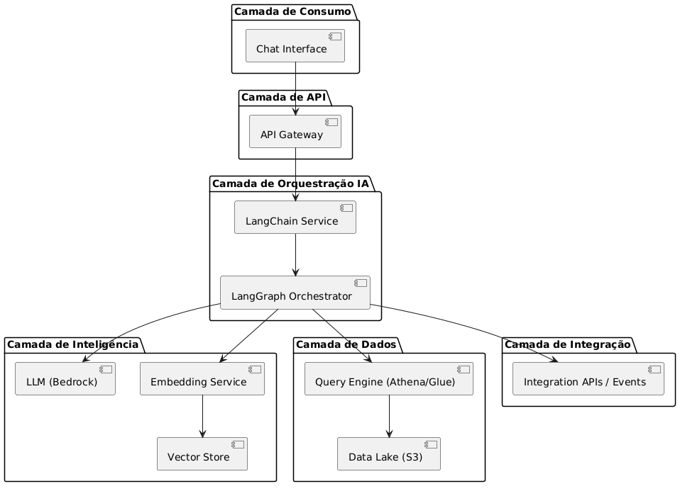

# Consulta de dados do data lake usando linguagem natural

**Camada de consumo com IA**

A solucao sera composta em 4 camadas: 
- ingestão de dados, 
- armazenamento, 
- processamento/IA,
- consumo.

**consumo**

Chat interface / API

**Processamento / Orquestracao IA

LangChain → consulta e realiza integração aplicando a logica
LangGraph → fluxo multi-step, busca os dados, transforma dados em embeddings, envia contexto

** Inteligencia

SageMaker → modelos preditivos
LLM via Bedrock

**fonte dados - ingestao**

S3 / Data Lake
Camadas: raw / curated / trusted
Sistemas transacionais (ERP, CRM, etc)
APIs externas

**integracao**
APIs expostas

